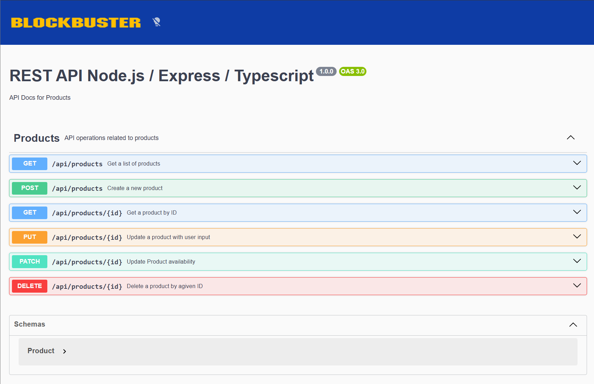

<h1 align="center">Product API 🛒</h1>

<p align="center">
  <b>API REST moderna para gestión de productos</b><br/>
  Node.js · Express · TypeScript · MongoDB
</p>

<p align="center">
  
  
  
  
  
</p>

---

## 📌 Descripción

**Product API** es una API REST desarrollada con **Node.js, Express y TypeScript** que permite realizar operaciones CRUD sobre productos.

El proyecto incluye:
- Documentación interactiva con **Swagger**
- Pruebas automatizadas con **Jest y Supertest**
- Arquitectura modular y escalable

💼 **Proyecto desarrollado para portafolio profesional.**

---

## ✨ Features

✔ CRUD de productos  
✔ Validación de datos  
✔ Manejo de errores centralizado  
✔ Testing de integración  
✔ Documentación Swagger  
✔ Estructura limpia y mantenible  

---

## 🛠️ Stack Tecnológico

### Backend
- Node.js
- Express
- TypeScript

### Base de datos
- MongoDB

### Testing
- Jest
- Supertest

### Documentación
- Swagger

---

## ⚙️ Instalación y configuración

```bash
# Clonar repositorio
git clone https://github.com/Rafaelarac/Administrador-de-Productos-REST-API.git

# Entrar al proyecto
cd product-api

# Instalar dependencias
npm install

---



